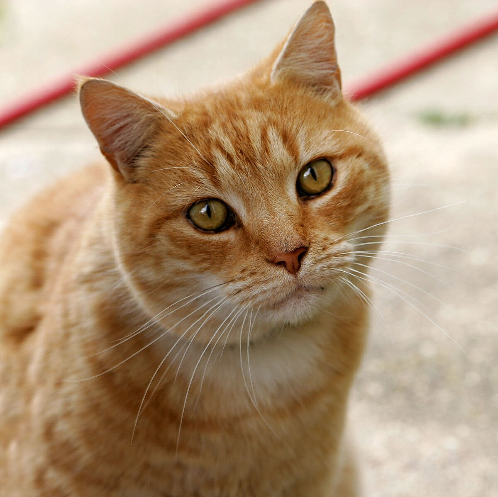

# OpenRouter Bug: Images in tool_result are corrupted/ignored

## Summary

When sending an image inside a `tool_result` content block to OpenRouter's `/api/v1/messages` endpoint, the model hallucinates and describes a completely different image. The same request works correctly on Anthropic's API.

## The Image

This is `test.jpg` - an orange tabby cat (filename intentionally doesn't hint at content):



## Quick Repro

Just clone and run two curl commands:

```bash
git clone https://github.com/Vercantez/openrouter-image-bug
cd openrouter-image-bug

# Anthropic (correct - describes orange tabby cat)
curl -s https://api.anthropic.com/v1/messages \
  -H "content-type: application/json" \
  -H "x-api-key: $ANTHROPIC_API_KEY" \
  -H "anthropic-version: 2023-06-01" \
  -d @repro.json | jq -r '.content[0].text'

# OpenRouter (incorrect - hallucinates different image)
curl -s https://openrouter.ai/api/v1/messages \
  -H "content-type: application/json" \
  -H "x-api-key: $OPENROUTER_API_KEY" \
  -H "anthropic-version: 2023-06-01" \
  -d @repro.json | jq -r '.content[0].text'
```

## The Bug

| API | Response |
|-----|----------|
| **Anthropic** | ✅ Consistently "orange tabby cat with golden-yellow eyes" |
| **OpenRouter** | ⚠️ Inconsistent - sometimes correct, often hallucinates wrong colors/scenes |

**The bug is intermittent.** Run the OpenRouter curl multiple times - you'll get different results:
- Sometimes correct: "orange/ginger tabby"
- Often wrong: "gray tabby", "brown and black coloring", "winter landscape", etc.

## Request Structure

The issue is with images nested inside `tool_result` blocks (`repro.json`):

```json
{
  "model": "claude-opus-4-5-20251101",
  "max_tokens": 1024,
  "tools": [{
    "name": "read_image",
    "description": "Read an image file from disk",
    "input_schema": {
      "type": "object",
      "properties": { "path": { "type": "string" } },
      "required": ["path"]
    }
  }],
  "messages": [
    {
      "role": "user",
      "content": "Read the image at test.jpg and describe what you see"
    },
    {
      "role": "assistant",
      "content": [{
        "type": "tool_use",
        "id": "toolu_01ABC123",
        "name": "read_image",
        "input": { "path": "test.jpg" }
      }]
    },
    {
      "role": "user",
      "content": [{
        "type": "tool_result",
        "tool_use_id": "toolu_01ABC123",
        "content": [{
          "type": "image",
          "source": {
            "type": "base64",
            "media_type": "image/jpeg",
            "data": "<BASE64_DATA_IN_REPRO_JSON>"
          }
        }]
      }]
    }
  ]
}
```

## Key Finding

- ✅ **Images in direct user messages** work correctly on both APIs
- ❌ **Images inside `tool_result` blocks** fail only on OpenRouter

## Environment

- Model: `claude-opus-4-5-20251101`
- OpenRouter endpoint: `https://openrouter.ai/api/v1/messages`
- Date discovered: 2026-01-28
